# 💿 SpinSense

Integrate your analogue record player into your digital life. SpinSense listens to your turntable, identifies the track that's playing with audio recognition, and surfaces it in Home Assistant as a `media_player` — so the song spinning on your deck shows up alongside the rest of your smart home.

## ✨ Features

- **Automatic track ID** — powered by a Shazam-compatible recognizer for high-accuracy identification of whatever's on the platter.
- **Zero-config Home Assistant discovery** — auto-appears as a `media_player` via **mDNS** (no broker, recommended) or **MQTT** discovery.
- **Runs where your deck is** — Docker-first; works on a Raspberry Pi (ARM) next to the turntable or on your x64 NAS.
- **Guided onboarding** — a built-in web wizard walks you through mic selection and "silence vs. music" calibration.
- **Local & private** — recognition and history stay on your hardware.

---

## 🚀 Installation

SpinSense runs as a Docker container. The examples below use [Dockge](https://github.com/louislam/dockge), but any `docker compose` setup works.

### Prerequisites

- A host running Docker (Linux recommended; Raspberry Pi or x64 NAS both fine).
- An **audio input** the host can see — typically your turntable's output into a USB audio interface or the host's line-in (exposed to the container via `/dev/snd`).
- *(Optional)* A Home Assistant instance on the same LAN for the integration.

### Recommended audio interface

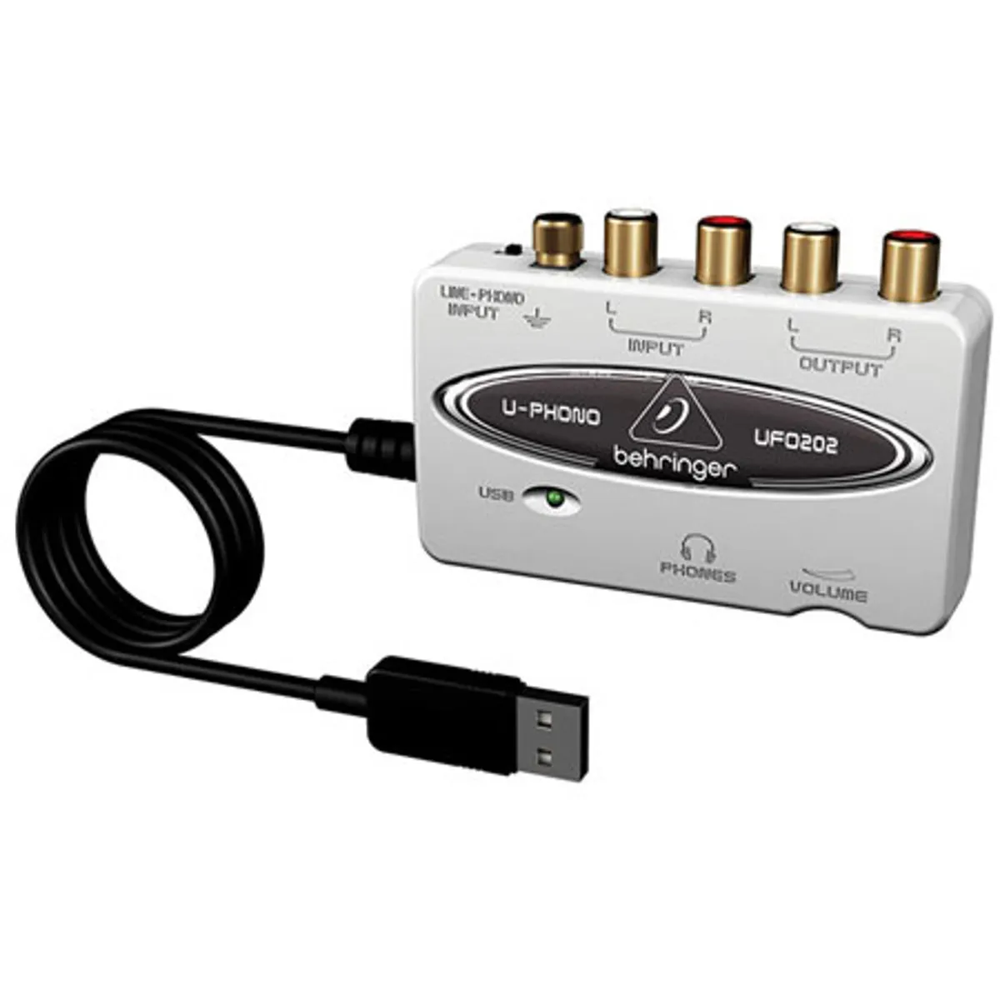

SpinSense works with any audio input the host can see, but **the interface matters** — many add processing that subtly degrades the sound. After trying a number of them, the **Behringer U-PHONO** interfaces are what I recommend: they act almost like a passthrough, so your turntable's signal reaches your speakers untouched while SpinSense samples a copy. Cheap, widely available, and the only ones I found that don't compromise playback quality. Pick based on your setup:

- **Behringer UFO202** *(pictured)* — has a **built-in phono preamp** plus an RCA output that passes straight through to your amplifier. Plug a turntable directly in. The simplest option if your deck doesn't already have a preamp.
- **Behringer UCA202 / UCA222** — **line-level** (no built-in phono preamp). Ideal if your turntable or receiver already provides phono preamplification.

### Compose

```yaml
services:
  spinsense:
    container_name: spinsense
    build:
      context: https://github.com/ycsgc1/SpinSense.git#main
      dockerfile: docker/Dockerfile
    network_mode: host                 # required for mDNS Home Assistant discovery
    devices:
      - /dev/snd:/dev/snd              # passes audio hardware into the container
    group_add:
      - audio                          # grants access to the audio devices
    environment:
      - SPINSENSE_DATA_DIR=/app/data    # where the database + album art live
      - SPINSENSE_PORT=3313             # web UI port (a nod to 33⅓ RPM)
    volumes:
      - ./data:/app/data               # persists history across rebuilds — keep this!
    restart: unless-stopped
```

Bring it up, then open the web UI at **`http://<your-host-ip>:3313`**.

> **Why host networking?** mDNS uses multicast, which doesn't cross Docker's bridge network. `network_mode: host` lets Home Assistant discover SpinSense — and means the app binds `SPINSENSE_PORT` directly on the host (no `ports:` mapping). If you don't need auto-discovery you can use bridge networking with `ports: ["3313:3313"]` instead, and integrate via MQTT.

> **Keep your history.** The SQLite database and album-art cache live under `SPINSENSE_DATA_DIR`. The `./data:/app/data` volume keeps them safe across rebuilds and updates — without it, a rebuild starts from an empty database.

### Updating

The container builds from the `main` branch. Because Docker caches the git context, force a fresh pull when updating:

```bash
docker compose build --no-cache spinsense && docker compose up -d
```

### Home Assistant integration

Install the companion integration so Home Assistant can discover SpinSense:

1. In **HACS → Custom repositories**, add `https://github.com/ycsgc1/homeassistant-spinsense` with category **Integration**, then install it and restart Home Assistant.
2. With SpinSense running (host networking), it's auto-discovered under **Settings → Devices & Services → Discovered** — accept it to add the `media_player` entity. No IP or port to type in.

Prefer MQTT? Skip the integration, enable MQTT in the setup wizard, and Home Assistant's MQTT integration will pick SpinSense up via MQTT discovery.

---

## 🎚️ Setup

The first time you open the web UI, SpinSense walks you through a short setup wizard. (You can re-run it anytime from **Settings → Re-run setup wizard**.)

### 1. Welcome

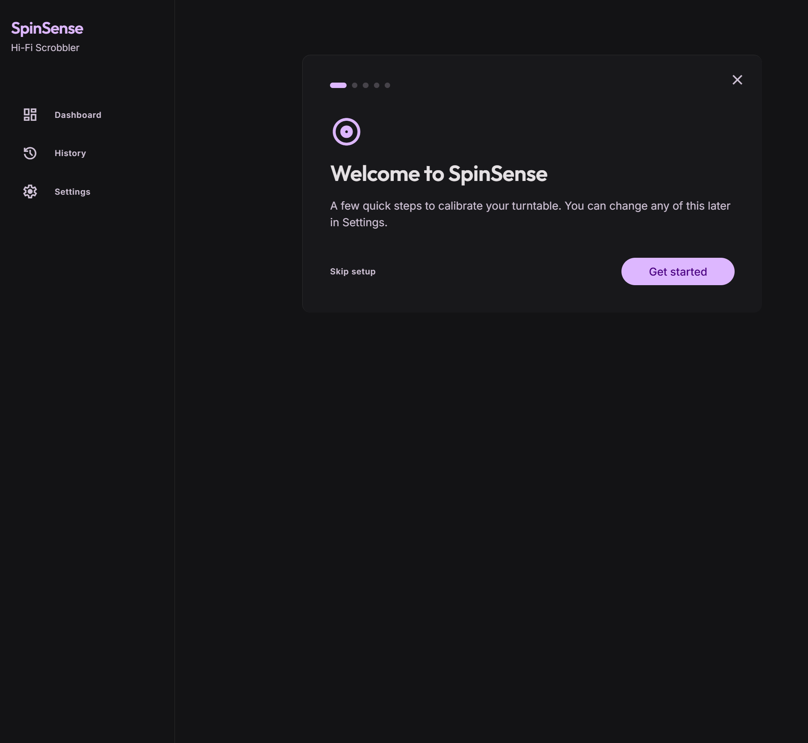

A quick intro. **Get started** to begin, or **Skip setup** to configure things manually later.

### 2. Pick your microphone

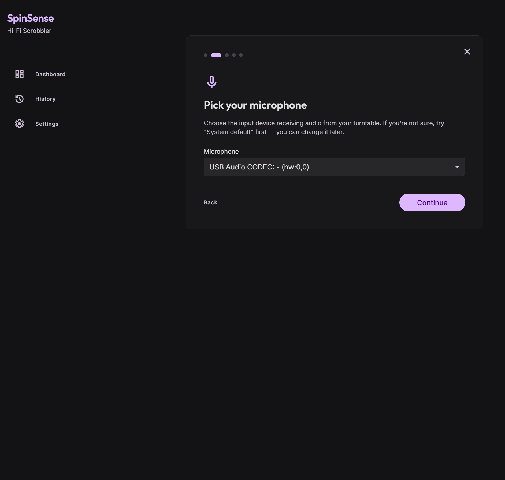

Choose the input device receiving audio from your turntable (e.g. a USB audio interface). The list comes from the devices the container can see; "System default" works if you only have one.

### 3. Calibrate the threshold

SpinSense tells "music" from "silence" using input volume, so it needs a threshold. There are two ways to set it:

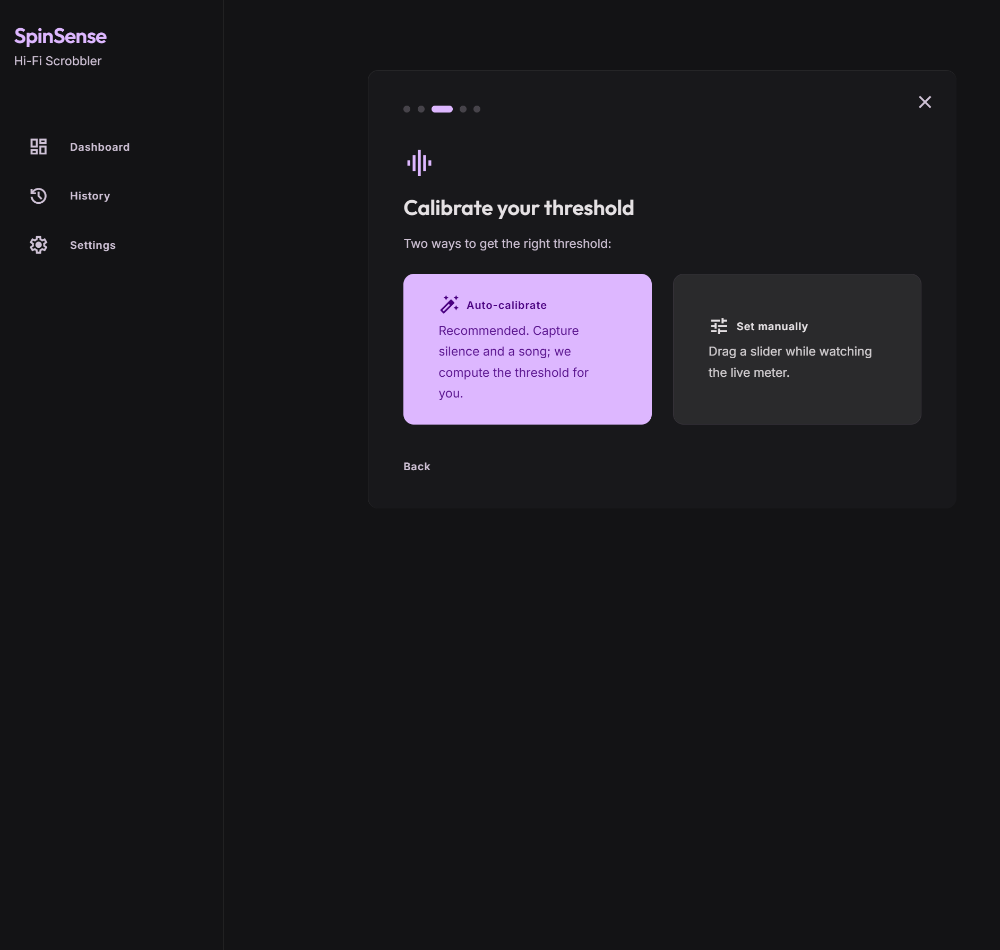

**Auto-calibrate (recommended)** captures your setup in two quick passes and computes the threshold for you:

| Step 1 — noise floor | Step 2 — a song |
|---|---|
| 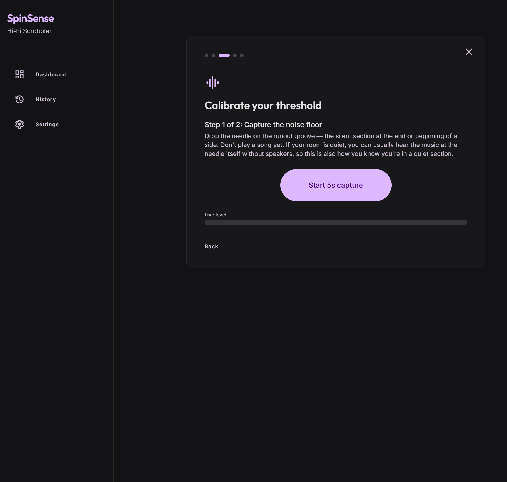 | 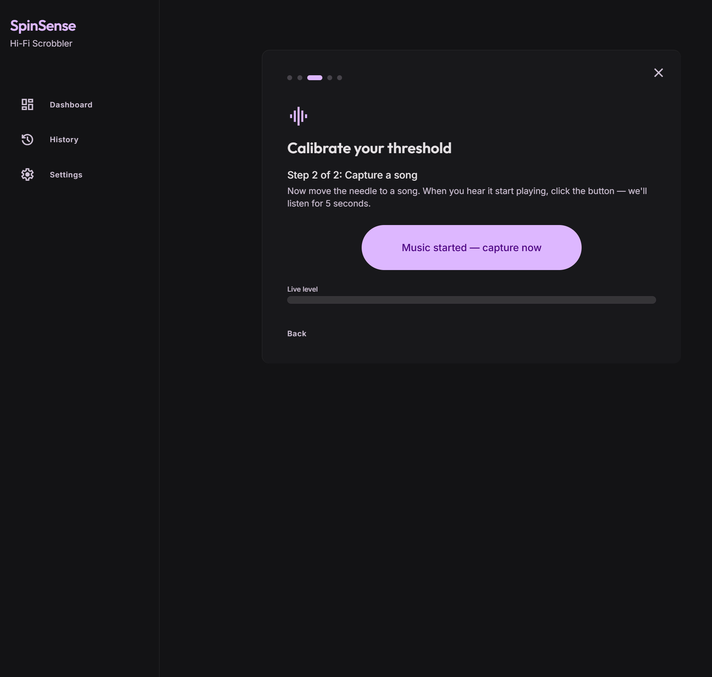 |
| Needle on the silent runout groove — capture 5s of "quiet". | Drop the needle on a song — capture 5s of "music". |

Or **set it manually**: drag the slider (shown in dB) while watching the live meter, and nudge it just above where the bar peaks during silence.

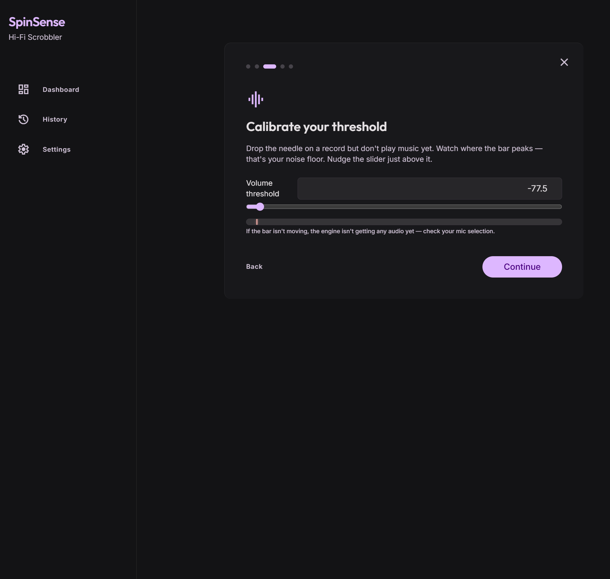

### 4. Connect to Home Assistant

Two independent toggles — run one, both, or neither:

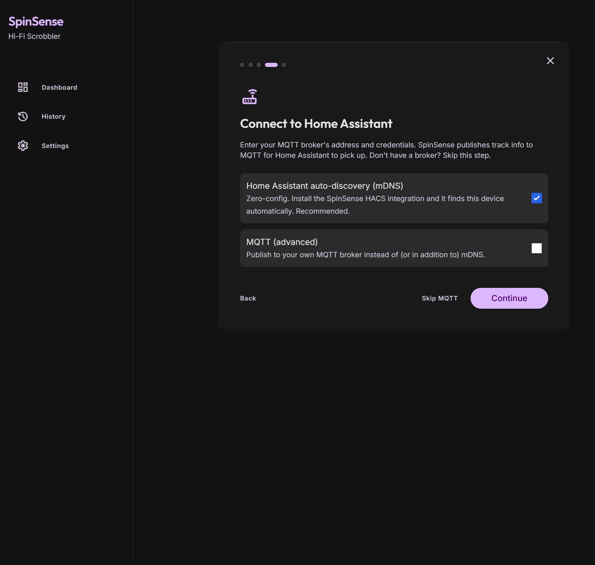

- **Home Assistant auto-discovery (mDNS)** *(on by default)* — zero-config; install the HACS integration and it finds SpinSense automatically. Recommended.
- **MQTT (advanced)** *(off by default)* — enable to publish to your own broker; this reveals the host / port / credentials and a "Test connection" button:

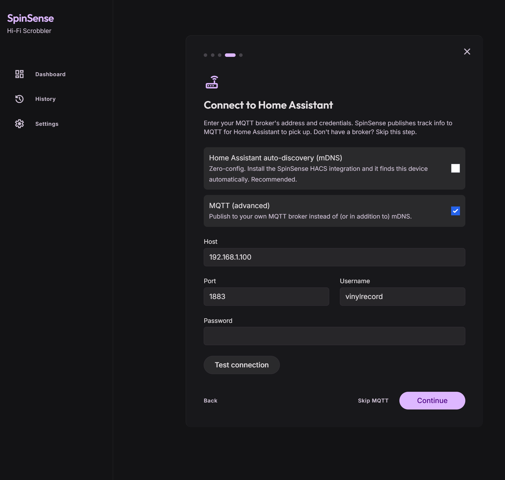

### 5. Finish

Save and finish applies everything to the running engine — no restart needed. Drop the needle and you're off.

---

## 📺 Usage

### Dashboard

When nothing's playing, the dashboard waits for a record and shows your live input level:

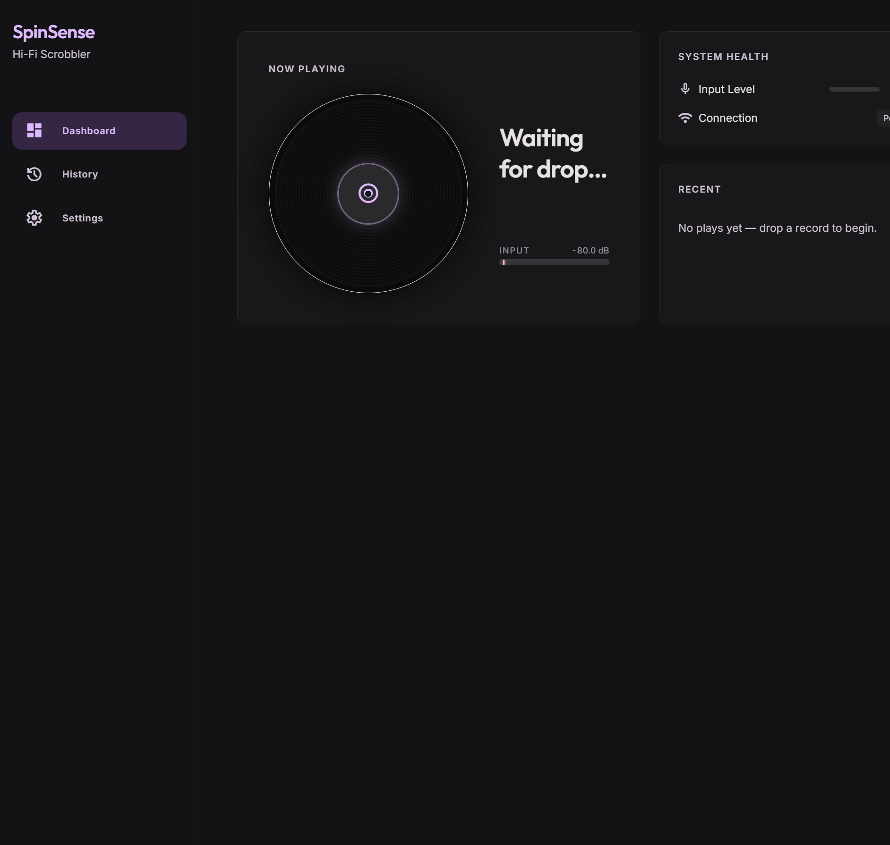

Drop the needle and it lights up with the current track — album art, title, artist — alongside system health and your recent plays:

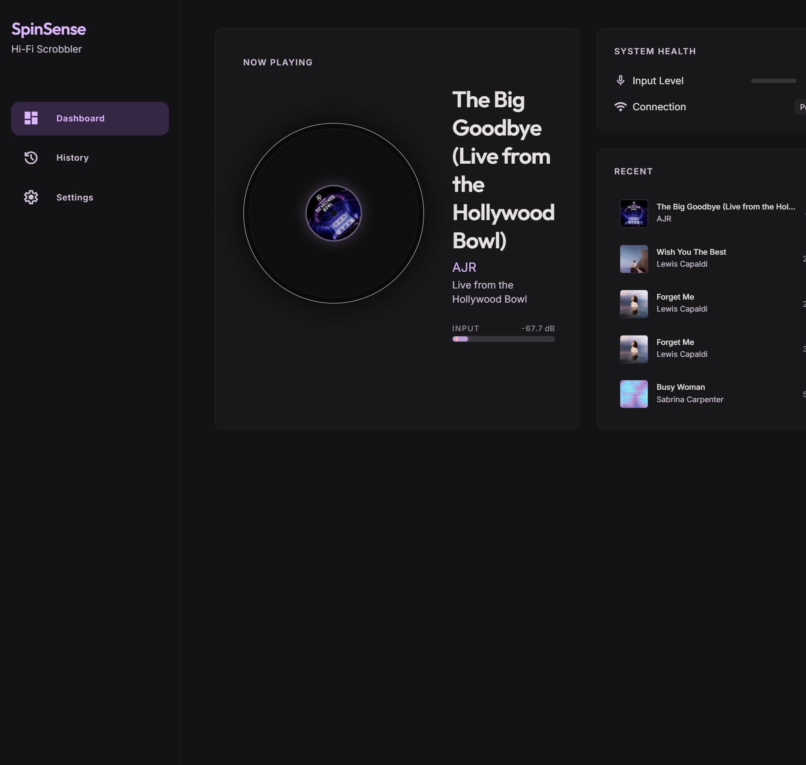

### History

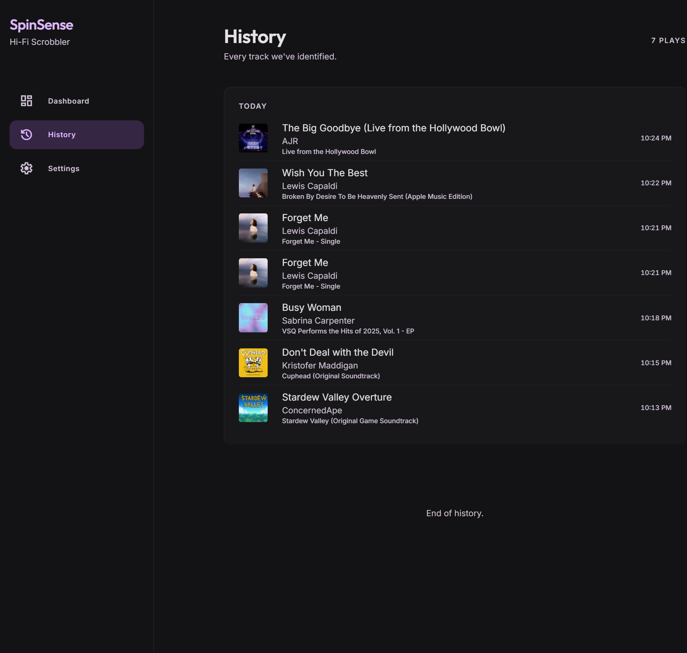

Every identified track is logged with its art and timestamp, grouped by day — scroll back through everything you've spun.

### In Home Assistant

Once discovered, SpinSense appears as a `media_player` entity that reflects the current track in real time — ready for dashboards, automations (dim the lights when a record starts?), and voice queries.

---

## 🔬 How It Works

SpinSense doesn't guess — it watches the RMS volume of your input device:

1. **Detection** — input rises above your calibrated threshold.
2. **Recognition** — it captures a short high-fidelity sample and identifies the track.
3. **Publish** — artist, title, album, and art are pushed to Home Assistant (via mDNS/HTTP or MQTT).
4. **Silence logic** — when the side ends or the record stops, it waits out a silence interval, then marks the player stopped.

## 🛠 Project Structure

Modular and Docker-first:

- **`/core`** — the Python recognition engine (audio capture, identification, MQTT).
- **`/gui`** — a FastAPI web interface for the dashboard, history, settings, wizard, and the `/api` + WebSocket the Home Assistant integration consumes.
- **`/docker`** — build files for Pi and NAS.

## 🏠 Related

- **Home Assistant integration:** [ycsgc1/homeassistant-spinsense](https://github.com/ycsgc1/homeassistant-spinsense)
